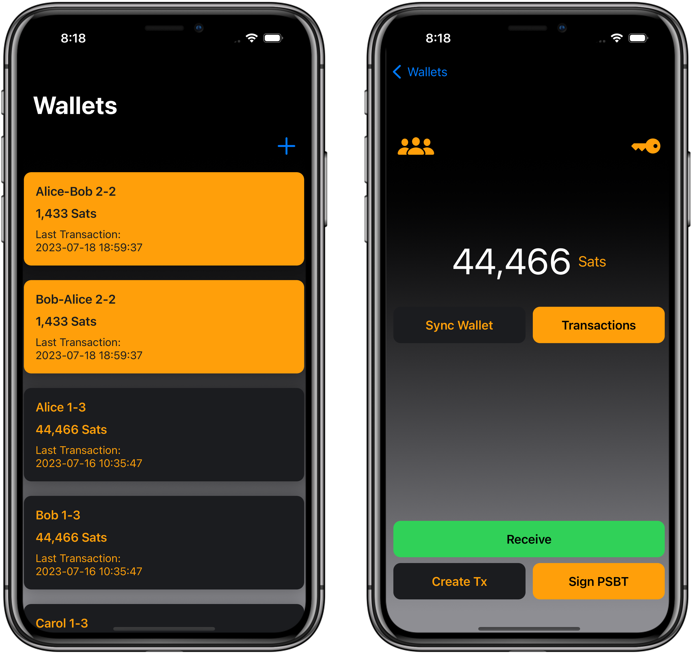

# Satoshi Guard

*Important: Wallet has been thoroughly tested for m-of-2 and m-of-3 wallets. Be advised that someone who has access to your __unlocked__ phone may gain access to your keys*

Satoshi Guard is an iOS app to create and manage Bitcoin mulitsignature wallets. The app was created using
the [Bitcoin Development Kit (BDK)](https://bitcoindevkit.org/) and was heavily inspired by
the [BDKSwiftSample](https://github.com/futurepaul/BdkSwiftSample) app. The app already offers the core of features. It
is possible to send and receive funds only with the app. Furthermore, it is possible to set up a completely new wallet from
scratch. The app supports both testnet and the Bitcoin mainnet.

## Testflight

The app is currently available for download in testflight [here](https://testflight.apple.com/join/dq0ciBGx). I'm happy about any
feedback and improvement ideas.

## Getting Started

### Setup

A brief overview of the steps. You will need to set your own private key and set the xpubs of your partners. Then you
have to select the policy that you want to follow (e.g. 1-of-2 2-of-3 or any m-of-n combination). The exact steps are
below:

1. Create a wallet from the start screen, give it a name and choose a network (Testnet or Bitcoin)
2. Click on the wallet panel and setup the necessary keys
    1. Private key
        1. Go to the keys view, key icon (top right)
        2. `Set Private Key` -> enter an existing 12 or 24 word mnemonic phrase or generate a new one (make sure you
           back it up securely)
        3. click `Set Key`
    2. Setting the other public keys
        1. Go to the xpub settings, group icon (top left)
        2. You can either scan the xpub QR codes of your partners or copy-paste them into the fields. In Satoshi Guard
           you can find a QR code of the xpub
           in the Key view
        3. Choose the policy and confirm

### Sending Funds

1. Go to `create tx` and scan the QR code displayed to you or enter the address into the address field
2. Enter the amount you want to send (in sats)
3. If you want, change the fee rate (for testnet 1 sat/vB should be fine)
4. Generate the PSBT (this will be automatically signed on your part when you generate it)
    1. if you have a 1-of-N wallet then you can skip the steps 6. and 7.
5. Send the PSBT to your peers that have to sign it as well. You can now also scan the QR-Code of the PSBT. (needs to be
   done one after another currently separately
   signed PSBTs can't be combined so: A signs -> B signs the PSBT signed by A -> C signs the PSBT which was signed by
   both A and B)
6. To sign a PSBT go to `Sign` on the home screen and paste the PSBT into the text field. You can now also scan the
   QR-Code of the PSBT.
7. If you are the last one to sign click on `Sign and Broadcast` otherwise click on `Sign` and copy the signed PSBT and
   send it to the next peer. You can now also scan the QR-Code of the PSBT.

## Technical Details

Currently, a multi signature wallet is created from three keys so an m-of-3 wallet is created in the app. In the future
it
will be possible to create a multi signature wallet with any number of keys.
Private keys are created from a 12 or 24 word mnemonic seed. The extended public keys are derived at the derivation
path `m/84'/1'/0'/0`. For the multi signature wallet the descriptor
is `wsh(sortedmulti(<threshold>,<xprv>/84'/1'/0'/0/*,<xpub_1>,<...>,<xpub_n>))`. An example xpub looks like
this `[f633291d/84'/1'/0'/0]tpubDFRv1ZiyjayHHiJgzFtf18nTdCC94Ga2hbLXmz77JiHJNvDgRjuEFBHezZGsbWe4o2jiWp5xCSi3mz3Gqdqnqm22Wu8aevGvTuQjg423J3z/*`
and a possible extended private key (xprv) will look like
this `tprv8ZgxMBicQKsPctqTQfSWzH3Gf7rbQymf3shwKBidXjdzFivui85uKgMJTjc1Er73QtAErKCVvwYwUiekbQxKAB7mSuJLFG34foKnG7dQUNF`.
Keep in mind that these are testnet keys. The wallets can be recovered using any descriptor based wallet software (
e.g. [bdk-cli](https://github.com/bitcoindevkit/bdk-cli)).

## Todos

- [x] Activate mainnet capabilities
- [x] Enable flexible number of m-of-n multisig wallets
- [ ] Better handling of change utxos in balance
- [x] Fix thread blocking syncs when switching to receive view to fast after opening home view
- [ ] Improve error handling
- [ ] Write tests
- [x] Allow QR-Code sharing of PSBTs
- [ ] Improve sharing of PSBTs
- [ ] Add support for combination of individually signed PSBTs

## Caveats

Currently, the balance display is not optimal. The change from a sending transaction is counted as untrusted and is
therefor not counted into the balance. So if a wallet only has one utxo and sends a transaction the balance will be
temporarily displayed as zero. The reason is that the one utxo that the wallet held is spent and the change is not yet
recognized as settled. A better handling of this situation is on the todo list. 

## Me
npub14agjgx6a67trjefrvllewlju2l92pyttuud2pfhydjguc63zvehs88dadk
